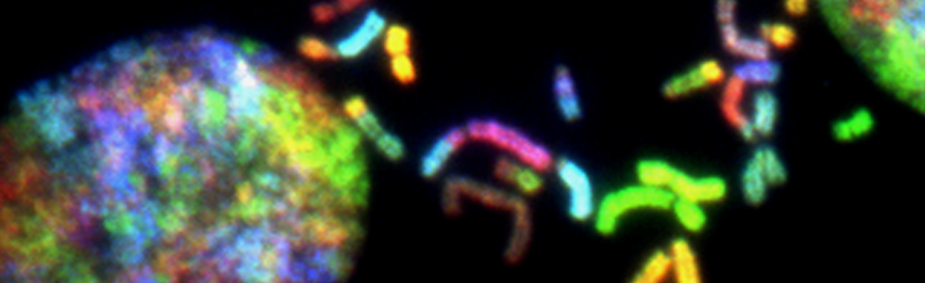

# Python against Cancer
*This repository will contain materials and references related to bioinformatics and cancer research.*
***

Hi there! Here is my personal cancer research hobby project. I have no medical or biological degree, so my vision is purely based on data science. I tried to collect enough theoretical material so that an amateur like me could approach the problem from different angles and make one's little contribution. The repository will be updated whenever possible. Feel free to join me if you have the same passion and interest. Thank you, and may the Force be with you!

***

Photo: [National Cancer Institute. Brain Cancer Chromosomes.](https://unsplash.com/photos/J28Nn-CDbII) Chromosomes prepared from a malignant glioblastoma visualized by spectral karyotyping (SKY) reveal an enormous degree of chromosomal instability -- a hallmark of cancer. Created by Thomas Ried, 2014

# Conferences
[National Cancer Institute](https://www.cancer.gov/news-events/events/conferences)

[American Association for Cancer Research](https://www.aacr.org/professionals/meetings/meetings-and-workshops-calendar/)

[Cancer Research Institute](https://www.cancerresearch.org/events/conferences)

# Let's start with some theory

[Why is it so hard to cure cancer?](https://www.youtube.com/watch?v=h2rR77VsF5c) Kyuson Yun, TED-Ed 2017

> "Why is it so difficult to cure cancer? After billions of dollars in research, we have not found a solution for a disease that affects more than 14 million people and their families at any given time.

> Cancer arises as normal cells accumulate mutations. Most of the time, cells can detect mutations or DNA damage and either fix them or self destruct. However, some mutations allow cancerous cells to grow unchecked and invade nearby tissues, or even metastasize to distant organs.

> Cancers become almost incurable once they metastasize. And cancer is incredibly complex. It is not just one disease. There are more than 100 different types and we don't have a magic bullet that can cure all of them.

> For most cancers, treatments usually include a combination of surgery to remove tumors and radiation and chemotherapy to kill any cancerous cells left behind. Hormone therapies, immunotherapy, and targeted treatments tailored for a specific type of cancer are sometimes used, too. In many cases, these treatments are effective and the patient becomes cancer-free. But they are far from 100% effective 100% of the time.

> So what would we have to do to find cures for all the different forms of cancer? We are beginning to understand a few of the problems scientists would have to solve.

> First of all, we need new, better ways of studying cancer. Most cancer treatments are developed using cell lines grown in labs from cultures of human tumors. These cultured cells have given us critical insights about cancer genetics and biology, but they lack much of the complexity of a tumor in an actual living organism.

> It is frequently the case that new drugs, which work on these lab-grown cells, will fail in clinical trials with real patients. One of the complexities of aggressive tumors is that they can have multiple populations of slightly different cancerous cells. Over time, distinct genetic mutations accumulate in cells in different parts of the tumor, giving rise to unique subclones.

> For example, aggressive brain tumors called glioblastomas can have as many as six different subclones in a single patient. This is called clonal heterogeneity, and it makes treatment difficult because a drug that works on one subclone may have no effect on another.

> Here is another challenge. A tumor is a dynamic interconnected ecosystem where cancer cells constantly communicate with each other and with healthy cells nearby.
They can induce normal cells to form  blood vessels that feed the tumor and remove waste products. They can also interact with the immune system to actually supress its function, keeping it from recognizing or destroying the cancer.

> If we could learn how to shut down these lines of communication, we would have a better shot at vanquishing a tumor permanently. Additionally, mounting evidence suggests we will need to figure out how to eradicate cancer stem cells. These are rare but seem to have special properties to make them resistant to chemotherapy and radiation.

> In theory, even if the rest of the tumor shrinks beyond detection during treatment, a single residual cancer stem cell could seed the growth of a new tumor. Figuring out how to target these stubborn cells might help prevent cancers from coming back.

> Even if we solved those problems, we might face new ones. Cancer cells are masters of adaptation, adjusting their molecular and cellular characteristics to survive under stress. When they are bombarded by radiation or chemotherapy, some cancer cells can effectively switch on protective shields against whatever's attacking them by changing their gene expression. Malignant cancers are complex systems that constantly evolve and adapt. To defeat them, we need to find experimental systems that match their complexity, and monitoring and treatment options that can adjust as the cancer changes.

> But the good news is we are making progress. Even with all we don't know, the average mortality rate for most kinds of cancer has dropped significantly since the 1970s and is still falling. We are learning more every day, and each new piece of information gives us one more tool to add to our arsenal."

***

[Open-source cancer research](https://www.youtube.com/watch?v=wOiKRVH0nQ8) Jay Bradner, TED 2011
> JQ1 molecule

***

[Fighting Cancer with Python](https://www.youtube.com/watch?v=AnwkXglmLGQ&list=LL&index=4) Erik Evensen, 2015

> Central dogma of biology says that we have a genomic information (the instructions for life) encoded in DNA, which is transcribed and ultimately translated into proteins which carry out these instructions.

> DNA -> transcription -> RNA -> translation -> Protein

> In terms of Python, DNA is being our source code, and the proteins is being our byte code.

> ~25,000 genes or ~90,000 proteins (which are interrelated and interract with each other)

> Networks interacting woth network

***

[Introduction to Cancer Bioinformatics I: Inferring Genomic Variation from Tumor Sequencing Data](https://simons.berkeley.edu/talks/ben-raphael-and-niko-beerenwinkel-2016-01-20-01) Ben Raphael (Brown University) and Niko Beerenwinkel (ETH Zürich), 2016

[Introduction to Cancer Bioinformatics II: Tumor Phylogeny](https://simons.berkeley.edu/talks/ben-raphael-and-niko-beerenwinkel-2016-01-20-02) Ben Raphael (Brown University) and Niko Beerenwinkel (ETH Zürich), 2016

[Introduction to Cancer Bioinformatics III: Cancer Progression Networks](https://simons.berkeley.edu/talks/niko-beerenwinkel-2016-01-21) Niko Beerenwinkel (ETH Zürich), 2016

***

[MIT CompBio Lecture 22 - Cancer Genomics (Fall 2019)](https://www.youtube.com/watch?v=E9YxwgKZWUw)
***

[Artificial intelligence for pathology](https://www.youtube.com/watch?v=3NiFjm_SiFs&list=LL&index=2)
***

[Introduction to Digital Pathology and AI Algorithms](https://www.youtube.com/watch?v=XYpGX3-TTIw&list=LL&index=3)

***

# Alternative views

[The Truth About Cancer - Global Quest 2015](https://www.youtube.com/watch?v=lnhZKHU44mI&list=PLNtE1N93r23BT0AOX6rkXiSV7S3Rizs7g&index=1)

***

# Bioinformatics Fundamentals for Python

[How Big Data is transforming biology and how we are using Python to make sense](https://www.youtube.com/watch?v=UFnoxLN17ko) Maria Nattestad, PyData NYC 2015

[Five steps for getting started with bioinformatics](https://www.youtube.com/watch?v=52Q0MYWbHCs&list=PLevQaddMWNQw76TYDYlgqfpoPsqfppRPQ&index=3) Maria Nattestad, OMGenomics

# Literature

Siddhartha Mukherjee, [The Emperor of All Maladies: A Biography of Cancer](https://www.amazon.com/gp/product/B003UYUP58/ref=dbs_a_def_rwt_hsch_vapi_tkin_p1_i0)

Andreas D. Baxevanis, B. F. Francis Ouellette (Editors), [Bioinformatics: A Practical Guide to the Analysis of Genes and Proteins](https://www.amazon.com/Bioinformatics-Practical-Guide-Analysis-Proteins/dp/0471478784)

[Biopython Tutorial and Cookbook](http://biopython.org/DIST/docs/tutorial/Tutorial.pdf)

***

